# Calgary Traffic Incident

## Introduction
This study aims to shed light on various aspects of traffic incidents in Calgary, with a specific emphasis on understanding the frequency and patterns of incidents based on different neighborhoods, time of day, and the safety concerns for pedestrians and cyclists.

Calgary, as a bustling urban center, experiences its fair share of traffic incidents, impacting the lives of its residents and visitors.

One of the key guiding questions explored in the project is how the frequency of incidents differs based on the neighborhoods of Calgary. By mapping and analyzing incident data geographically, the main project aim is to identify areas that may have a higher incidence of traffic-related incidents. Understanding these neighborhood-specific variations will enable us to pinpoint areas that require targeted interventions and proactive measures to enhance safety and reduce the occurrence of incidents.

Another crucial aspect investigated is how the frequency of traffic incidents in Calgary changes based on the time of day. Traffic patterns and congestion levels can vary significantly throughout the day, and understanding how incidents are influenced by these temporal factors is essential for effective traffic management. By analyzing incident data across different time intervals, it can be identified peak incident hours, assess the impact of rush hour congestion, and develop strategies to alleviate these issues during specific time periods.

In addition to neighborhood and temporal analysis, the project focuses on identifying the most dangerous areas for pedestrians and cyclists in Calgary. Pedestrians and cyclists are vulnerable road users who require special attention and protection. By examining incident data involving pedestrians and cyclists, the aim is to identify high-risk areas where these road users face increased dangers. This knowledge will aid in implementing targeted safety measures, improving infrastructure, and designing initiatives to promote safer conditions for pedestrians and cyclists in Calgary.

Through this data-driven approach and advanced analytical techniques, the aim is to provide evidence-based insights and actionable recommendations for traffic management authorities, urban planners, and policymakers. By answering the guiding questions mentioned above, it can be contributed to the development of effective strategies to enhance traffic safety, optimize resource allocation, and create a more pedestrian and cyclist-friendly city.


## Dataset
The dataset used for the Calgary Traffic Incidents analysis in this project is obtained from the City of Calgary's official data portal, data.calgary.ca. This dataset is a comprehensive archive of traffic incidents within the city, regularly updated every 10 minutes to ensure the most current information is available. It covers a substantial time span, starting from December 6, 2016, up to the present day.

It's important to note that the dataset may have occasional gaps due to system or script malfunctions, which can result in missing or incomplete incident records. However, every effort is made to maintain the accuracy and completeness of the data.

The dataset provides essential information about each traffic incident, including a description of the incident itself, geolocation, and address details. This information enables precise identification and mapping of incident locations. Additionally, the dataset includes the quadrant of the city where each incident occurred, allowing for further analysis and exploration of incident patterns specific to different areas within Calgary.

Another crucial component of the dataset is the time of each incident, providing insights into when incidents occur throughout the day. This temporal information allows for analyzing the frequency and distribution of incidents based on different time intervals, enabling the identification of peak incident hours and temporal trends.

The dataset is made available under the Open Government License - City of Calgary, which encourages the free use, distribution, and modification of the data while maintaining acknowledgment of the City of Calgary as the original source.

It's worth noting that for more detailed information and context regarding the traffic incidents, users can refer to the Calgary Traffic Report page, which provides additional insights, updates, and relevant information related to traffic incidents in the city.

By leveraging this comprehensive and regularly updated dataset, our project aims to extract meaningful insights, identify trends, and develop strategies to enhance traffic management, improve road safety, and optimize transportation systems in Calgary.

Dataset: https://data.calgary.ca/Transportation-Transit/Traffic-Incidents/35ra-9556


## Methodology
### 1. Data Cleaning and Data Wrangling
The data cleaning step in this project involves preparing the initial dataset obtained from the City of Calgary's data portal for analysis by addressing missing or incomplete information and identifying potential issues with the dataset.


```python
import pandas as pd
import plotly.express as px
import plotly.graph_objects as go
import seaborn as s
import matplotlib.pyplot as plt
import numpy as np
import geopandas as gpd
from shapely.geometry import Point
import datetime
```


```python
df2 = pd.read_csv('Traffic_Incidents.csv')
df2
```


<div>
<style scoped>
    .dataframe tbody tr th:only-of-type {
        vertical-align: middle;
    }

    .dataframe tbody tr th {
        vertical-align: top;
    }

    .dataframe thead th {
        text-align: right;
    }
</style>
<table border="1" class="dataframe">
  <thead>
    <tr style="text-align: right;">
      <th></th>
      <th>INCIDENT INFO</th>
      <th>DESCRIPTION</th>
      <th>START_DT</th>
      <th>MODIFIED_DT</th>
      <th>QUADRANT</th>
      <th>Longitude</th>
      <th>Latitude</th>
      <th>Count</th>
      <th>id</th>
      <th>Point</th>
    </tr>
  </thead>
  <tbody>
    <tr>
      <th>0</th>
      <td>Westbound 16 Avenue at Deerfoot Trail NE</td>
      <td>Stalled vehicle.  Partially blocking the right...</td>
      <td>2022/06/21 07:31:40 AM</td>
      <td>2022/06/21 07:33:16 AM</td>
      <td>NE</td>
      <td>-114.026687</td>
      <td>51.067485</td>
      <td>1</td>
      <td>2022-06-21T07:31:4051.067485129276236-114.0266...</td>
      <td>POINT (-114.02668672232672 51.067485129276236)</td>
    </tr>
    <tr>
      <th>1</th>
      <td>11 Avenue and 4 Street SW</td>
      <td>Traffic incident. Blocking multiple lanes</td>
      <td>2022/06/21 04:02:11 AM</td>
      <td>2022/06/21 04:12:38 AM</td>
      <td>SW</td>
      <td>-114.071481</td>
      <td>51.042624</td>
      <td>1</td>
      <td>2022-06-21T04:02:1151.04262449261462-114.07148...</td>
      <td>POINT (-114.07148057660925 51.04262449261462)</td>
    </tr>
    <tr>
      <th>2</th>
      <td>68 Street and Memorial Drive E</td>
      <td>Traffic incident.</td>
      <td>2022/06/20 11:53:08 PM</td>
      <td>2022/06/20 11:55:42 PM</td>
      <td>NE</td>
      <td>-113.935553</td>
      <td>51.052474</td>
      <td>1</td>
      <td>2022-06-20T23:53:0851.0524735056658-113.935553...</td>
      <td>POINT (-113.935553325751 51.0524735056658)</td>
    </tr>
    <tr>
      <th>3</th>
      <td>Eastbound 16 Avenue and 36 Street NE</td>
      <td>Traffic incident. Blocking the left shoulder</td>
      <td>2022/06/20 04:43:21 PM</td>
      <td>2022/06/20 05:17:05 PM</td>
      <td>NE</td>
      <td>-113.989219</td>
      <td>51.067086</td>
      <td>1</td>
      <td>2022-06-20T16:43:2151.06708565896752-113.98921...</td>
      <td>POINT (-113.98921905311566 51.06708565896752)</td>
    </tr>
    <tr>
      <th>4</th>
      <td>Barlow Trail and 61 Avenue SE</td>
      <td>Traffic incident.</td>
      <td>2022/06/20 04:42:12 PM</td>
      <td>2022/06/20 05:28:21 PM</td>
      <td>SE</td>
      <td>-113.985727</td>
      <td>50.998727</td>
      <td>1</td>
      <td>2022-06-20T16:42:1250.99872748477766-113.98572...</td>
      <td>POINT (-113.98572655353505 50.99872748477766)</td>
    </tr>
    <tr>
      <th>...</th>
      <td>...</td>
      <td>...</td>
      <td>...</td>
      <td>...</td>
      <td>...</td>
      <td>...</td>
      <td>...</td>
      <td>...</td>
      <td>...</td>
      <td>...</td>
    </tr>
    <tr>
      <th>39581</th>
      <td>Aero Gate and 11 Street NE</td>
      <td>Traffic incident.</td>
      <td>2023/05/17 07:22:44 AM</td>
      <td>2023/05/17 09:00:43 AM</td>
      <td>NE</td>
      <td>-114.039109</td>
      <td>51.120601</td>
      <td>1</td>
      <td>2023-05-17T07:22:4451.12060124821737-114.03910...</td>
      <td>POINT (-114.03910908721207 51.12060124821737)</td>
    </tr>
    <tr>
      <th>39582</th>
      <td>Eastbound Glenmore Trail and Crowchild Trail SW</td>
      <td>Multi-vehicle incident. Blocking the left lane</td>
      <td>2023/05/17 08:59:09 AM</td>
      <td>2023/05/17 09:00:43 AM</td>
      <td>SW</td>
      <td>-114.122814</td>
      <td>51.001318</td>
      <td>1</td>
      <td>2023-05-17T08:59:0951.00131795970452-114.12281...</td>
      <td>POINT (-114.12281385934625 51.00131795970452)</td>
    </tr>
    <tr>
      <th>39583</th>
      <td>17 Avenue and 36 Street SE</td>
      <td>NB 36 St closed at 17 Ave. WB 17 Ave closed at...</td>
      <td>2023/05/17 04:18:57 AM</td>
      <td>2023/05/17 09:11:54 AM</td>
      <td>SE</td>
      <td>-113.981546</td>
      <td>51.038037</td>
      <td>1</td>
      <td>2023-05-17T04:18:5751.03803711297289-113.98154...</td>
      <td>POINT (-113.9815464139313 51.03803711297289)</td>
    </tr>
    <tr>
      <th>39584</th>
      <td>Northbound Crowchild Trail approaching Kensin...</td>
      <td>Stalled vehicle. Blocking the middle lane</td>
      <td>2023/05/17 01:12:03 PM</td>
      <td>2023/05/17 01:13:47 PM</td>
      <td>NW</td>
      <td>-114.118501</td>
      <td>51.052492</td>
      <td>1</td>
      <td>2023-05-17T13:12:0351.05249233303009-114.11850...</td>
      <td>POINT (-114.11850138362924 51.05249233303009)</td>
    </tr>
    <tr>
      <th>39585</th>
      <td>Northbound Falconridge Boulevard and Falworth...</td>
      <td>Traffic incident.</td>
      <td>2023/05/17 04:58:17 PM</td>
      <td>2023/05/17 05:40:31 PM</td>
      <td>NE</td>
      <td>-113.956155</td>
      <td>51.102931</td>
      <td>1</td>
      <td>2023-05-17T16:58:1751.10293072063497-113.95615...</td>
      <td>POINT (-113.9561550734143 51.10293072063497)</td>
    </tr>
  </tbody>
</table>
<p>39586 rows × 10 columns</p>
</div>


The initial dataset contains 39,586 rows of data. However, approximately 35.4% of these rows do not have quadrant data, which is a crucial attribute for analyzing incident patterns across different areas of Calgary. Despite this missing information, it is observed that most of the incident descriptions contain indirect indications of the quadrant in which they occurred. This valuable information allows us to fill the gaps in the quadrant data and retain these rows for analysis, ensuring that important incident data is not lost.


```python
for i, row in df2.iterrows():
    if pd.isna(row['QUADRANT']):
        if 'NE' in row['INCIDENT INFO']:
            df2.at[i, 'QUADRANT'] = 'NE'
        elif 'NW' in row['INCIDENT INFO']:
            df2.at[i, 'QUADRANT'] = 'NW'       
        elif 'SW' in row['INCIDENT INFO']:
            df2.at[i, 'QUADRANT'] = 'SW'
        elif 'SE' in row['INCIDENT INFO']:
            df2.at[i, 'QUADRANT'] = 'SE'

```


```python
df2[df2.isna().any(axis=1)].isnull().sum()
```


    INCIDENT INFO        0
    DESCRIPTION          2
    START_DT             0
    MODIFIED_DT      14057
    QUADRANT           301
    Longitude            0
    Latitude             0
    Count                0
    id                   0
    Point                0
    dtype: int64


```python
df = df2.dropna(subset = ['DESCRIPTION'])
df
```


<div>
<style scoped>
    .dataframe tbody tr th:only-of-type {
        vertical-align: middle;
    }

    .dataframe tbody tr th {
        vertical-align: top;
    }

    .dataframe thead th {
        text-align: right;
    }
</style>
<table border="1" class="dataframe">
  <thead>
    <tr style="text-align: right;">
      <th></th>
      <th>INCIDENT INFO</th>
      <th>DESCRIPTION</th>
      <th>START_DT</th>
      <th>MODIFIED_DT</th>
      <th>QUADRANT</th>
      <th>Longitude</th>
      <th>Latitude</th>
      <th>Count</th>
      <th>id</th>
      <th>Point</th>
    </tr>
  </thead>
  <tbody>
    <tr>
      <th>0</th>
      <td>Westbound 16 Avenue at Deerfoot Trail NE</td>
      <td>Stalled vehicle.  Partially blocking the right...</td>
      <td>2022/06/21 07:31:40 AM</td>
      <td>2022/06/21 07:33:16 AM</td>
      <td>NE</td>
      <td>-114.026687</td>
      <td>51.067485</td>
      <td>1</td>
      <td>2022-06-21T07:31:4051.067485129276236-114.0266...</td>
      <td>POINT (-114.02668672232672 51.067485129276236)</td>
    </tr>
    <tr>
      <th>1</th>
      <td>11 Avenue and 4 Street SW</td>
      <td>Traffic incident. Blocking multiple lanes</td>
      <td>2022/06/21 04:02:11 AM</td>
      <td>2022/06/21 04:12:38 AM</td>
      <td>SW</td>
      <td>-114.071481</td>
      <td>51.042624</td>
      <td>1</td>
      <td>2022-06-21T04:02:1151.04262449261462-114.07148...</td>
      <td>POINT (-114.07148057660925 51.04262449261462)</td>
    </tr>
    <tr>
      <th>2</th>
      <td>68 Street and Memorial Drive E</td>
      <td>Traffic incident.</td>
      <td>2022/06/20 11:53:08 PM</td>
      <td>2022/06/20 11:55:42 PM</td>
      <td>NE</td>
      <td>-113.935553</td>
      <td>51.052474</td>
      <td>1</td>
      <td>2022-06-20T23:53:0851.0524735056658-113.935553...</td>
      <td>POINT (-113.935553325751 51.0524735056658)</td>
    </tr>
    <tr>
      <th>3</th>
      <td>Eastbound 16 Avenue and 36 Street NE</td>
      <td>Traffic incident. Blocking the left shoulder</td>
      <td>2022/06/20 04:43:21 PM</td>
      <td>2022/06/20 05:17:05 PM</td>
      <td>NE</td>
      <td>-113.989219</td>
      <td>51.067086</td>
      <td>1</td>
      <td>2022-06-20T16:43:2151.06708565896752-113.98921...</td>
      <td>POINT (-113.98921905311566 51.06708565896752)</td>
    </tr>
    <tr>
      <th>4</th>
      <td>Barlow Trail and 61 Avenue SE</td>
      <td>Traffic incident.</td>
      <td>2022/06/20 04:42:12 PM</td>
      <td>2022/06/20 05:28:21 PM</td>
      <td>SE</td>
      <td>-113.985727</td>
      <td>50.998727</td>
      <td>1</td>
      <td>2022-06-20T16:42:1250.99872748477766-113.98572...</td>
      <td>POINT (-113.98572655353505 50.99872748477766)</td>
    </tr>
    <tr>
      <th>...</th>
      <td>...</td>
      <td>...</td>
      <td>...</td>
      <td>...</td>
      <td>...</td>
      <td>...</td>
      <td>...</td>
      <td>...</td>
      <td>...</td>
      <td>...</td>
    </tr>
    <tr>
      <th>39581</th>
      <td>Aero Gate and 11 Street NE</td>
      <td>Traffic incident.</td>
      <td>2023/05/17 07:22:44 AM</td>
      <td>2023/05/17 09:00:43 AM</td>
      <td>NE</td>
      <td>-114.039109</td>
      <td>51.120601</td>
      <td>1</td>
      <td>2023-05-17T07:22:4451.12060124821737-114.03910...</td>
      <td>POINT (-114.03910908721207 51.12060124821737)</td>
    </tr>
    <tr>
      <th>39582</th>
      <td>Eastbound Glenmore Trail and Crowchild Trail SW</td>
      <td>Multi-vehicle incident. Blocking the left lane</td>
      <td>2023/05/17 08:59:09 AM</td>
      <td>2023/05/17 09:00:43 AM</td>
      <td>SW</td>
      <td>-114.122814</td>
      <td>51.001318</td>
      <td>1</td>
      <td>2023-05-17T08:59:0951.00131795970452-114.12281...</td>
      <td>POINT (-114.12281385934625 51.00131795970452)</td>
    </tr>
    <tr>
      <th>39583</th>
      <td>17 Avenue and 36 Street SE</td>
      <td>NB 36 St closed at 17 Ave. WB 17 Ave closed at...</td>
      <td>2023/05/17 04:18:57 AM</td>
      <td>2023/05/17 09:11:54 AM</td>
      <td>SE</td>
      <td>-113.981546</td>
      <td>51.038037</td>
      <td>1</td>
      <td>2023-05-17T04:18:5751.03803711297289-113.98154...</td>
      <td>POINT (-113.9815464139313 51.03803711297289)</td>
    </tr>
    <tr>
      <th>39584</th>
      <td>Northbound Crowchild Trail approaching Kensin...</td>
      <td>Stalled vehicle. Blocking the middle lane</td>
      <td>2023/05/17 01:12:03 PM</td>
      <td>2023/05/17 01:13:47 PM</td>
      <td>NW</td>
      <td>-114.118501</td>
      <td>51.052492</td>
      <td>1</td>
      <td>2023-05-17T13:12:0351.05249233303009-114.11850...</td>
      <td>POINT (-114.11850138362924 51.05249233303009)</td>
    </tr>
    <tr>
      <th>39585</th>
      <td>Northbound Falconridge Boulevard and Falworth...</td>
      <td>Traffic incident.</td>
      <td>2023/05/17 04:58:17 PM</td>
      <td>2023/05/17 05:40:31 PM</td>
      <td>NE</td>
      <td>-113.956155</td>
      <td>51.102931</td>
      <td>1</td>
      <td>2023-05-17T16:58:1751.10293072063497-113.95615...</td>
      <td>POINT (-113.9561550734143 51.10293072063497)</td>
    </tr>
  </tbody>
</table>
<p>39584 rows × 10 columns</p>
</div>


Further investigation reveals that the gaps in quadrant data and the MODIFIED_DT column exist from March 2019 until October 2021. Notably, during the period from June 14, 2019, to September 15, 2019, there is only one row of data available. This fact suggests the possibility of data entry rule changes during that period or a potential incident that led to the loss of data. It is essential to keep this information in mind during the analysis of the results to ensure accurate interpretation and avoid any potential biases introduced by these gaps.

Additionally, the initial dataset includes a column named DESCRIPTION, which provides valuable insights into the types of incidents that occur in different locations. Parsing and analyzing this column can provide a better understanding of the specific types of incidents that take place across various areas of Calgary, enabling a more comprehensive analysis of the dataset.


```python
#display(pd.DataFrame(df2['DESCRIPTION'].unique()))
#df['col'].str.contains('partial_string').any()
df.loc[df['DESCRIPTION'].str.contains('Traffic incident'), 'itype'] = 'Traffic incident'
df.loc[df['DESCRIPTION'].str.contains('Stalled vehicle') | df['DESCRIPTION'].str.contains('stalled vehicle'), 'itype'] = 'Stalled vehicle'
df.loc[df['DESCRIPTION'].str.contains('Single vehicle incident'), 'itype'] = 'Single vehicle incident'
df.loc[df['DESCRIPTION'].str.contains('Two vehicle incident') | df['DESCRIPTION'].str.contains('2 vehicle incident'), 'itype'] = 'Two vehicle incident'
df.loc[(df['DESCRIPTION'].str.contains('Multi-vehicle incident')) | (df['DESCRIPTION'].str.contains('Multi vehicle incident')), 'itype'] = 'Multi-vehicle incident'
df.loc[(df['DESCRIPTION'].str.contains('incident involving a cyclist')|(df['DESCRIPTION'].str.contains('bicycle'))), 'itype'] = 'Incident involving a cyclist'
df.loc[(df['DESCRIPTION'].str.contains('Traffic signal')) | (df['DESCRIPTION'].str.contains('Traffic light')) 
       | (df['DESCRIPTION'].str.contains('traffic signal')) | (df['DESCRIPTION'].str.contains('traffic Signal')) 
       | (df['DESCRIPTION'].str.contains('traffic light')) | (df['DESCRIPTION'].str.contains('light'))
       | (df['DESCRIPTION'].str.contains('Signal light')) | (df['DESCRIPTION'].str.contains('Light stuck'))
       | (df['DESCRIPTION'].str.contains('Light on flash') | (df['DESCRIPTION'].str.contains('signals'))), 'itype'] = 'Traffic lights incident'

df.loc[(df['DESCRIPTION'].str.contains('Slow traffic'))  | (df['DESCRIPTION'].str.contains('slow moving')) 
       | (df['DESCRIPTION'].str.contains('Please go slow')), 'itype'] = 'Slow traffic'

df.loc[(df['DESCRIPTION'].str.contains('Blocking') |df['DESCRIPTION'].str.contains('blocked')| df['DESCRIPTION'].str.contains('blocking')) 
       & (df['DESCRIPTION'].str.contains('lane') | df['DESCRIPTION'].str.contains('shoulder')
       |  df['DESCRIPTION'].str.contains('Traffic') | df['DESCRIPTION'].str.contains('traffic')), 'itype'] = 'Blocked lane/shoulder/ramp'

df.loc[(df['DESCRIPTION'].str.contains('closed')) | (df['DESCRIPTION'].str.contains('closures')) | (df['DESCRIPTION'].str.contains('ramp'))
       | (df['DESCRIPTION'].str.contains('disruption')), 'itype'] = 'Road closed'

df.loc[(df['DESCRIPTION'].str.contains('fire')), 'itype'] = 'Fire incident'
df.loc[(df['DESCRIPTION'].str.contains('Police')) | (df['DESCRIPTION'].str.contains('police')), 'itype'] = 'Police incident'
df.loc[(df['DESCRIPTION'].str.contains('LRT')) | (df['DESCRIPTION'].str.contains('train')) | (df['DESCRIPTION'].str.contains('Train')) 
       | (df['DESCRIPTION'].str.contains('Railway')), 'itype'] = 'LRT/Railway incident'
df.loc[(df['DESCRIPTION'].str.contains('incident involving a pedestrian')) | (df['DESCRIPTION'].str.contains('pedestrian incident')) 
       | (df['DESCRIPTION'].str.contains('Incident involving a pedestrian')), 'itype'] = 'Incident involving a pedestrian'
df.loc[(df['DESCRIPTION'].str.contains('going incident')), 'itype'] = 'Ongoing incident'
df.loc[df['itype'].isna(), 'itype'] = 'Other'#]#& df['DESCRIPTION'].str.contains('versus'), 'DESCRIPTION'].iloc[0]
```

    /var/folders/9z/scwdbhm50c1848gsllv1nqk80000gn/T/ipykernel_29114/71809234.py:3: SettingWithCopyWarning: 
    A value is trying to be set on a copy of a slice from a DataFrame.
    Try using .loc[row_indexer,col_indexer] = value instead
    
    See the caveats in the documentation: https://pandas.pydata.org/pandas-docs/stable/user_guide/indexing.html#returning-a-view-versus-a-copy
      df.loc[df['DESCRIPTION'].str.contains('Traffic incident'), 'itype'] = 'Traffic incident'


```python
df['itype'].value_counts()
```


    Blocked lane/shoulder/ramp         13831
    Two vehicle incident                8596
    Traffic incident                    7679
    Single vehicle incident             2461
    Multi-vehicle incident              1654
    Traffic lights incident             1564
    Road closed                         1451
    Incident involving a pedestrian     1359
    Stalled vehicle                      426
    Incident involving a cyclist         203
    Ongoing incident                     132
    Police incident                       82
    Other                                 68
    LRT/Railway incident                  51
    Fire incident                         19
    Slow traffic                           8
    Name: itype, dtype: int64


```python
df['itype'].count()
```


    39584


By addressing missing quadrant data, noting the gaps in the MODIFIED_DT column, and leveraging the information in the DESCRIPTION column, the data cleaning step ensures that the dataset is prepared for subsequent analysis, enabling accurate and meaningful insights into the Calgary Traffic Incidents data.


### 2. Incident Data and Geo-spatial Data Merging

To gain a better understanding of the incident distribution across different neighborhoods in Calgary, an additional step was taken in the data processing pipeline. Since the initial dataset did not include the neighborhood information for each incident, the dataset was merged with the geo-spatial data of community boundaries from the City of Calgary's open data portal.

The merging process involved using the latitude and longitude coordinates provided in the initial dataset to connect each incident with its corresponding neighborhood. This was achieved by utilizing the sjoin function from the geopandas library, which performs a spatial join based on the geometry of each community boundary.

By merging the incident data with the community boundary data, each incident was assigned to the specific neighborhood in which it occurred. This integration allowed for a comprehensive analysis of the incident distribution across different neighborhoods within Calgary.

Following the merging process, the data was grouped by the neighborhood name and incident type. This grouping facilitated the aggregation of incidents, providing a count of each incident type within each neighborhood. As a result, a dataframe was obtained, containing the names of neighborhoods and the corresponding counts of each incident type.

This enriched dataframe with neighborhood information and incident counts enables a more detailed exploration of which communities in Calgary experience a higher frequency of incidents. This information can be valuable for understanding the safety concerns and traffic patterns specific to each neighborhood, aiding in targeted interventions and resource allocation to improve traffic management and enhance safety measures.

By leveraging the power of geospatial data and integrating it with the initial incident dataset, this step in the data processing pipeline contributes to a more comprehensive analysis of the incident distribution across neighborhoods in Calgary.


```python
census_file = './Census by Community 2019.geojson'
communities = gpd.read_file(census_file)
communities.index
```


    RangeIndex(start=0, stop=306, step=1)


```python
df_comm = communities[['name', 'geometry']]
df_comm.index
```


    RangeIndex(start=0, stop=306, step=1)


```python
gdf = gpd.GeoDataFrame(df, geometry=gpd.points_from_xy(df.Longitude, df.Latitude))
df_comm = df_comm.to_crs(epsg=4326)
gdf.crs = "EPSG:4326"
merged = gpd.sjoin(gdf, df_comm, how='left', predicate='within')
incident_counts = merged.groupby(['name', 'itype']).size()
incident_counts = incident_counts.reset_index(name='count')
incident_counts['count'].sum()
incident_counts
```


<div>
<style scoped>
    .dataframe tbody tr th:only-of-type {
        vertical-align: middle;
    }

    .dataframe tbody tr th {
        vertical-align: top;
    }

    .dataframe thead th {
        text-align: right;
    }
</style>
<table border="1" class="dataframe">
  <thead>
    <tr style="text-align: right;">
      <th></th>
      <th>name</th>
      <th>itype</th>
      <th>count</th>
    </tr>
  </thead>
  <tbody>
    <tr>
      <th>0</th>
      <td>01B</td>
      <td>Blocked lane/shoulder/ramp</td>
      <td>13</td>
    </tr>
    <tr>
      <th>1</th>
      <td>01B</td>
      <td>Multi-vehicle incident</td>
      <td>1</td>
    </tr>
    <tr>
      <th>2</th>
      <td>01B</td>
      <td>Road closed</td>
      <td>2</td>
    </tr>
    <tr>
      <th>3</th>
      <td>01B</td>
      <td>Single vehicle incident</td>
      <td>2</td>
    </tr>
    <tr>
      <th>4</th>
      <td>01B</td>
      <td>Stalled vehicle</td>
      <td>2</td>
    </tr>
    <tr>
      <th>...</th>
      <td>...</td>
      <td>...</td>
      <td>...</td>
    </tr>
    <tr>
      <th>2346</th>
      <td>WOODLANDS</td>
      <td>Single vehicle incident</td>
      <td>1</td>
    </tr>
    <tr>
      <th>2347</th>
      <td>WOODLANDS</td>
      <td>Traffic incident</td>
      <td>4</td>
    </tr>
    <tr>
      <th>2348</th>
      <td>WOODLANDS</td>
      <td>Traffic lights incident</td>
      <td>4</td>
    </tr>
    <tr>
      <th>2349</th>
      <td>WOODLANDS</td>
      <td>Two vehicle incident</td>
      <td>7</td>
    </tr>
    <tr>
      <th>2350</th>
      <td>YORKVILLE</td>
      <td>Traffic incident</td>
      <td>2</td>
    </tr>
  </tbody>
</table>
<p>2351 rows × 3 columns</p>
</div>


```python
gdf
```


<div>
<style scoped>
    .dataframe tbody tr th:only-of-type {
        vertical-align: middle;
    }

    .dataframe tbody tr th {
        vertical-align: top;
    }

    .dataframe thead th {
        text-align: right;
    }
</style>
<table border="1" class="dataframe">
  <thead>
    <tr style="text-align: right;">
      <th></th>
      <th>INCIDENT INFO</th>
      <th>DESCRIPTION</th>
      <th>START_DT</th>
      <th>MODIFIED_DT</th>
      <th>QUADRANT</th>
      <th>Longitude</th>
      <th>Latitude</th>
      <th>Count</th>
      <th>id</th>
      <th>Point</th>
      <th>itype</th>
      <th>geometry</th>
    </tr>
  </thead>
  <tbody>
    <tr>
      <th>0</th>
      <td>Westbound 16 Avenue at Deerfoot Trail NE</td>
      <td>Stalled vehicle.  Partially blocking the right...</td>
      <td>2022/06/21 07:31:40 AM</td>
      <td>2022/06/21 07:33:16 AM</td>
      <td>NE</td>
      <td>-114.026687</td>
      <td>51.067485</td>
      <td>1</td>
      <td>2022-06-21T07:31:4051.067485129276236-114.0266...</td>
      <td>POINT (-114.02668672232672 51.067485129276236)</td>
      <td>Blocked lane/shoulder/ramp</td>
      <td>POINT (-114.02669 51.06749)</td>
    </tr>
    <tr>
      <th>1</th>
      <td>11 Avenue and 4 Street SW</td>
      <td>Traffic incident. Blocking multiple lanes</td>
      <td>2022/06/21 04:02:11 AM</td>
      <td>2022/06/21 04:12:38 AM</td>
      <td>SW</td>
      <td>-114.071481</td>
      <td>51.042624</td>
      <td>1</td>
      <td>2022-06-21T04:02:1151.04262449261462-114.07148...</td>
      <td>POINT (-114.07148057660925 51.04262449261462)</td>
      <td>Blocked lane/shoulder/ramp</td>
      <td>POINT (-114.07148 51.04262)</td>
    </tr>
    <tr>
      <th>2</th>
      <td>68 Street and Memorial Drive E</td>
      <td>Traffic incident.</td>
      <td>2022/06/20 11:53:08 PM</td>
      <td>2022/06/20 11:55:42 PM</td>
      <td>NE</td>
      <td>-113.935553</td>
      <td>51.052474</td>
      <td>1</td>
      <td>2022-06-20T23:53:0851.0524735056658-113.935553...</td>
      <td>POINT (-113.935553325751 51.0524735056658)</td>
      <td>Traffic incident</td>
      <td>POINT (-113.93555 51.05247)</td>
    </tr>
    <tr>
      <th>3</th>
      <td>Eastbound 16 Avenue and 36 Street NE</td>
      <td>Traffic incident. Blocking the left shoulder</td>
      <td>2022/06/20 04:43:21 PM</td>
      <td>2022/06/20 05:17:05 PM</td>
      <td>NE</td>
      <td>-113.989219</td>
      <td>51.067086</td>
      <td>1</td>
      <td>2022-06-20T16:43:2151.06708565896752-113.98921...</td>
      <td>POINT (-113.98921905311566 51.06708565896752)</td>
      <td>Blocked lane/shoulder/ramp</td>
      <td>POINT (-113.98922 51.06709)</td>
    </tr>
    <tr>
      <th>4</th>
      <td>Barlow Trail and 61 Avenue SE</td>
      <td>Traffic incident.</td>
      <td>2022/06/20 04:42:12 PM</td>
      <td>2022/06/20 05:28:21 PM</td>
      <td>SE</td>
      <td>-113.985727</td>
      <td>50.998727</td>
      <td>1</td>
      <td>2022-06-20T16:42:1250.99872748477766-113.98572...</td>
      <td>POINT (-113.98572655353505 50.99872748477766)</td>
      <td>Traffic incident</td>
      <td>POINT (-113.98573 50.99873)</td>
    </tr>
    <tr>
      <th>...</th>
      <td>...</td>
      <td>...</td>
      <td>...</td>
      <td>...</td>
      <td>...</td>
      <td>...</td>
      <td>...</td>
      <td>...</td>
      <td>...</td>
      <td>...</td>
      <td>...</td>
      <td>...</td>
    </tr>
    <tr>
      <th>39581</th>
      <td>Aero Gate and 11 Street NE</td>
      <td>Traffic incident.</td>
      <td>2023/05/17 07:22:44 AM</td>
      <td>2023/05/17 09:00:43 AM</td>
      <td>NE</td>
      <td>-114.039109</td>
      <td>51.120601</td>
      <td>1</td>
      <td>2023-05-17T07:22:4451.12060124821737-114.03910...</td>
      <td>POINT (-114.03910908721207 51.12060124821737)</td>
      <td>Traffic incident</td>
      <td>POINT (-114.03911 51.12060)</td>
    </tr>
    <tr>
      <th>39582</th>
      <td>Eastbound Glenmore Trail and Crowchild Trail SW</td>
      <td>Multi-vehicle incident. Blocking the left lane</td>
      <td>2023/05/17 08:59:09 AM</td>
      <td>2023/05/17 09:00:43 AM</td>
      <td>SW</td>
      <td>-114.122814</td>
      <td>51.001318</td>
      <td>1</td>
      <td>2023-05-17T08:59:0951.00131795970452-114.12281...</td>
      <td>POINT (-114.12281385934625 51.00131795970452)</td>
      <td>Blocked lane/shoulder/ramp</td>
      <td>POINT (-114.12281 51.00132)</td>
    </tr>
    <tr>
      <th>39583</th>
      <td>17 Avenue and 36 Street SE</td>
      <td>NB 36 St closed at 17 Ave. WB 17 Ave closed at...</td>
      <td>2023/05/17 04:18:57 AM</td>
      <td>2023/05/17 09:11:54 AM</td>
      <td>SE</td>
      <td>-113.981546</td>
      <td>51.038037</td>
      <td>1</td>
      <td>2023-05-17T04:18:5751.03803711297289-113.98154...</td>
      <td>POINT (-113.9815464139313 51.03803711297289)</td>
      <td>Road closed</td>
      <td>POINT (-113.98155 51.03804)</td>
    </tr>
    <tr>
      <th>39584</th>
      <td>Northbound Crowchild Trail approaching Kensin...</td>
      <td>Stalled vehicle. Blocking the middle lane</td>
      <td>2023/05/17 01:12:03 PM</td>
      <td>2023/05/17 01:13:47 PM</td>
      <td>NW</td>
      <td>-114.118501</td>
      <td>51.052492</td>
      <td>1</td>
      <td>2023-05-17T13:12:0351.05249233303009-114.11850...</td>
      <td>POINT (-114.11850138362924 51.05249233303009)</td>
      <td>Blocked lane/shoulder/ramp</td>
      <td>POINT (-114.11850 51.05249)</td>
    </tr>
    <tr>
      <th>39585</th>
      <td>Northbound Falconridge Boulevard and Falworth...</td>
      <td>Traffic incident.</td>
      <td>2023/05/17 04:58:17 PM</td>
      <td>2023/05/17 05:40:31 PM</td>
      <td>NE</td>
      <td>-113.956155</td>
      <td>51.102931</td>
      <td>1</td>
      <td>2023-05-17T16:58:1751.10293072063497-113.95615...</td>
      <td>POINT (-113.9561550734143 51.10293072063497)</td>
      <td>Traffic incident</td>
      <td>POINT (-113.95616 51.10293)</td>
    </tr>
  </tbody>
</table>
<p>39584 rows × 12 columns</p>
</div>


```python
incident_counts_pivot = incident_counts.pivot(index=['name'], columns='itype', values='count')
incident_counts_pivot.reset_index(inplace=True)
incident_counts_pivot = incident_counts_pivot.fillna(0)
incident_counts_pivot['total'] = incident_counts_pivot.select_dtypes(include=['number']).sum(axis=1)
final_df = df_comm.merge(incident_counts_pivot, left_on='name', right_on='name')
final_df['total'].sum()
final_df.reset_index(inplace=True)
final_df
```


<div>
<style scoped>
    .dataframe tbody tr th:only-of-type {
        vertical-align: middle;
    }

    .dataframe tbody tr th {
        vertical-align: top;
    }

    .dataframe thead th {
        text-align: right;
    }
</style>
<table border="1" class="dataframe">
  <thead>
    <tr style="text-align: right;">
      <th></th>
      <th>index</th>
      <th>name</th>
      <th>geometry</th>
      <th>Blocked lane/shoulder/ramp</th>
      <th>Fire incident</th>
      <th>Incident involving a cyclist</th>
      <th>Incident involving a pedestrian</th>
      <th>LRT/Railway incident</th>
      <th>Multi-vehicle incident</th>
      <th>Ongoing incident</th>
      <th>Other</th>
      <th>Police incident</th>
      <th>Road closed</th>
      <th>Single vehicle incident</th>
      <th>Slow traffic</th>
      <th>Stalled vehicle</th>
      <th>Traffic incident</th>
      <th>Traffic lights incident</th>
      <th>Two vehicle incident</th>
      <th>total</th>
    </tr>
  </thead>
  <tbody>
    <tr>
      <th>0</th>
      <td>0</td>
      <td>LEGACY</td>
      <td>MULTIPOLYGON (((-114.02200 50.86308, -114.0213...</td>
      <td>7.0</td>
      <td>0.0</td>
      <td>0.0</td>
      <td>0.0</td>
      <td>0.0</td>
      <td>0.0</td>
      <td>0.0</td>
      <td>0.0</td>
      <td>0.0</td>
      <td>0.0</td>
      <td>1.0</td>
      <td>0.0</td>
      <td>0.0</td>
      <td>8.0</td>
      <td>3.0</td>
      <td>1.0</td>
      <td>20.0</td>
    </tr>
    <tr>
      <th>1</th>
      <td>1</td>
      <td>HIGHLAND PARK</td>
      <td>MULTIPOLYGON (((-114.06916 51.09565, -114.0667...</td>
      <td>14.0</td>
      <td>0.0</td>
      <td>0.0</td>
      <td>4.0</td>
      <td>0.0</td>
      <td>3.0</td>
      <td>0.0</td>
      <td>0.0</td>
      <td>0.0</td>
      <td>4.0</td>
      <td>8.0</td>
      <td>0.0</td>
      <td>0.0</td>
      <td>34.0</td>
      <td>5.0</td>
      <td>42.0</td>
      <td>114.0</td>
    </tr>
    <tr>
      <th>2</th>
      <td>2</td>
      <td>CORNERSTONE</td>
      <td>MULTIPOLYGON (((-113.91840 51.17607, -113.9166...</td>
      <td>9.0</td>
      <td>0.0</td>
      <td>2.0</td>
      <td>3.0</td>
      <td>0.0</td>
      <td>3.0</td>
      <td>0.0</td>
      <td>0.0</td>
      <td>1.0</td>
      <td>4.0</td>
      <td>19.0</td>
      <td>0.0</td>
      <td>0.0</td>
      <td>65.0</td>
      <td>0.0</td>
      <td>28.0</td>
      <td>134.0</td>
    </tr>
    <tr>
      <th>3</th>
      <td>3</td>
      <td>MONTGOMERY</td>
      <td>MULTIPOLYGON (((-114.16458 51.08145, -114.1644...</td>
      <td>33.0</td>
      <td>0.0</td>
      <td>4.0</td>
      <td>16.0</td>
      <td>0.0</td>
      <td>6.0</td>
      <td>6.0</td>
      <td>0.0</td>
      <td>1.0</td>
      <td>4.0</td>
      <td>12.0</td>
      <td>0.0</td>
      <td>0.0</td>
      <td>76.0</td>
      <td>10.0</td>
      <td>75.0</td>
      <td>243.0</td>
    </tr>
    <tr>
      <th>4</th>
      <td>4</td>
      <td>TEMPLE</td>
      <td>MULTIPOLYGON (((-113.93513 51.09608, -113.9351...</td>
      <td>47.0</td>
      <td>0.0</td>
      <td>1.0</td>
      <td>11.0</td>
      <td>0.0</td>
      <td>3.0</td>
      <td>4.0</td>
      <td>0.0</td>
      <td>0.0</td>
      <td>2.0</td>
      <td>4.0</td>
      <td>0.0</td>
      <td>0.0</td>
      <td>38.0</td>
      <td>9.0</td>
      <td>36.0</td>
      <td>155.0</td>
    </tr>
    <tr>
      <th>...</th>
      <td>...</td>
      <td>...</td>
      <td>...</td>
      <td>...</td>
      <td>...</td>
      <td>...</td>
      <td>...</td>
      <td>...</td>
      <td>...</td>
      <td>...</td>
      <td>...</td>
      <td>...</td>
      <td>...</td>
      <td>...</td>
      <td>...</td>
      <td>...</td>
      <td>...</td>
      <td>...</td>
      <td>...</td>
      <td>...</td>
    </tr>
    <tr>
      <th>290</th>
      <td>290</td>
      <td>01H</td>
      <td>MULTIPOLYGON (((-114.27030 51.10060, -114.2702...</td>
      <td>1.0</td>
      <td>0.0</td>
      <td>0.0</td>
      <td>0.0</td>
      <td>0.0</td>
      <td>1.0</td>
      <td>0.0</td>
      <td>0.0</td>
      <td>0.0</td>
      <td>2.0</td>
      <td>1.0</td>
      <td>0.0</td>
      <td>0.0</td>
      <td>3.0</td>
      <td>0.0</td>
      <td>2.0</td>
      <td>10.0</td>
    </tr>
    <tr>
      <th>291</th>
      <td>291</td>
      <td>HIDDEN VALLEY</td>
      <td>MULTIPOLYGON (((-114.09474 51.15426, -114.0947...</td>
      <td>57.0</td>
      <td>0.0</td>
      <td>0.0</td>
      <td>2.0</td>
      <td>0.0</td>
      <td>7.0</td>
      <td>0.0</td>
      <td>0.0</td>
      <td>1.0</td>
      <td>8.0</td>
      <td>23.0</td>
      <td>0.0</td>
      <td>3.0</td>
      <td>68.0</td>
      <td>4.0</td>
      <td>42.0</td>
      <td>215.0</td>
    </tr>
    <tr>
      <th>292</th>
      <td>292</td>
      <td>RIVERBEND</td>
      <td>MULTIPOLYGON (((-114.01581 50.98069, -114.0148...</td>
      <td>28.0</td>
      <td>0.0</td>
      <td>0.0</td>
      <td>3.0</td>
      <td>0.0</td>
      <td>5.0</td>
      <td>1.0</td>
      <td>0.0</td>
      <td>0.0</td>
      <td>8.0</td>
      <td>5.0</td>
      <td>0.0</td>
      <td>0.0</td>
      <td>20.0</td>
      <td>2.0</td>
      <td>22.0</td>
      <td>94.0</td>
    </tr>
    <tr>
      <th>293</th>
      <td>293</td>
      <td>RIDEAU PARK</td>
      <td>MULTIPOLYGON (((-114.07153 51.02885, -114.0715...</td>
      <td>0.0</td>
      <td>0.0</td>
      <td>1.0</td>
      <td>0.0</td>
      <td>0.0</td>
      <td>0.0</td>
      <td>0.0</td>
      <td>0.0</td>
      <td>0.0</td>
      <td>0.0</td>
      <td>1.0</td>
      <td>0.0</td>
      <td>0.0</td>
      <td>0.0</td>
      <td>0.0</td>
      <td>0.0</td>
      <td>2.0</td>
    </tr>
    <tr>
      <th>294</th>
      <td>294</td>
      <td>FRANKLIN</td>
      <td>MULTIPOLYGON (((-113.98171 51.06697, -113.9817...</td>
      <td>109.0</td>
      <td>1.0</td>
      <td>0.0</td>
      <td>7.0</td>
      <td>1.0</td>
      <td>7.0</td>
      <td>0.0</td>
      <td>0.0</td>
      <td>0.0</td>
      <td>7.0</td>
      <td>7.0</td>
      <td>0.0</td>
      <td>0.0</td>
      <td>31.0</td>
      <td>8.0</td>
      <td>49.0</td>
      <td>227.0</td>
    </tr>
  </tbody>
</table>
<p>295 rows × 20 columns</p>
</div>


```python
#final_df[final_df['name']=='BURNS INDUSTRIAL']
```

### 3. Visualization by Plotly
The use of the Plotly library for visualization in this project offers several advantages in terms of interactive and visually appealing representations of the data. Plotly is a powerful data visualization library that provides a range of chart types and interactive features, making it well-suited for showcasing spatial and temporal data.

One of the key visualizations used is the choropleth_mapbox, which is ideal for displaying geographic data such as incident distribution across neighborhoods. This chart type uses a map layout and color-coding to represent the density or intensity of a particular variable (in this case, incident counts) within different areas or regions. By leveraging Plotly's choropleth_mapbox, it becomes possible to create a visually compelling and informative representation of the incident distribution across Calgary's neighborhoods.

The bar chart is another visualization utilized in this project. Bar charts are effective for displaying categorical data and comparing frequencies or counts across different categories. Plotly's bar chart functionality allows for interactive exploration of the data, providing users with the ability to zoom in, hover over bars for detailed information, and customize the visual appearance of the chart.

Density_mapbox is a visualization tool that offers a heatmap-like representation of density patterns across a geographical area. In the context of this project, density_mapbox can be used to visualize the intensity of incidents in different neighborhoods, highlighting areas with higher incident densities. This visualization allows for a quick understanding of areas that may require more attention in terms of traffic management and safety measures.

Lastly, bar_polar is a chart type that can be used for visualizing cyclic or periodic data, such as incidents occurring throughout the day or year. It provides a circular representation, allowing for the exploration of patterns and trends over time. Plotly's bar_polar enables the creation of interactive and customizable polar bar charts, offering an intuitive way to analyze and compare incident frequencies within different time periods.

By utilizing Plotly's diverse chart types, including choropleth_mapbox, bar, density_mapbox, and bar_polar, the visualization step in this project ensures that the analyzed data is presented in a visually engaging and informative manner. This facilitates a deeper understanding of incident patterns, time-related trends, and the spatial distribution of incidents in Calgary.

## Guiding questions
### 1. How does the frequency of incidents differ based on the neighbourhoods of Calgary?
The question aims to understand the variation in the number of incidents across different neighborhoods in Calgary. By analyzing the incident data and considering the neighborhood information, insights can be gained into which areas experience a higher frequency of incidents and potentially require more attention in terms of traffic management and safety measures. Based on the findings, it is observed that the South East of Calgary tends to have the highest number of incidents. This suggests that this area may experience more traffic-related issues compared to other neighborhoods.


```python
final_df = final_df.to_crs(epsg=4326)

# Need to be careful with the options or you'll end up with just the base map
fig = px.choropleth_mapbox(final_df, geojson=final_df,
                           locations=final_df.index, 
                           color="total",
                           color_continuous_scale=['white', 'red'],
                           center={"lat": 51.0486, "lon": -114.0708}, # Calgary
                           mapbox_style='open-street-map',
                           opacity=0.75,
                           zoom=10, 
                           title = 'Calgary Trafic incidents map by neighbourhood',
                           hover_name='name')

fig.update_layout(margin={"r":50,"t":50,"l":50,"b":50}, 
                  autosize=True,
                  height=1000 )
fig.update_geos(showcountries=True, showcoastlines=True, showland=True, fitbounds="locations")

fig.write_image("fig1.png")
```

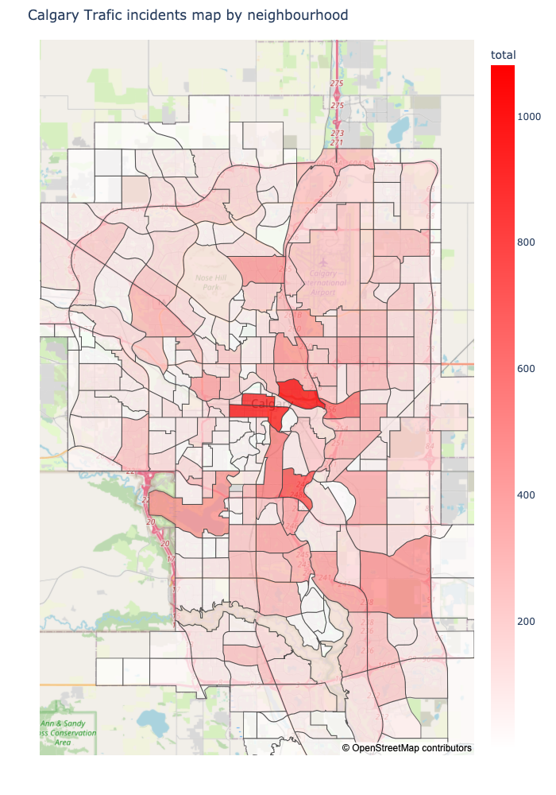

The specific types of incidents prevalent in this region are related to blocked lanes or roads and multi-vehicle incidents, indicating potential congestion and traffic flow challenges in this area.


```python
qs = gpd.read_file('City Quadrants.geojson')
qs = qs.to_crs(epsg=4326)
merged2 = gpd.sjoin(gdf, qs, how='left', predicate='within')
incident_counts2 = merged2.groupby(['QUADRANT', 'itype']).size()
incident_counts2 = incident_counts2.reset_index(name='count')
incident_counts2['count'].sum()
incident_counts2
```


<div>
<style scoped>
    .dataframe tbody tr th:only-of-type {
        vertical-align: middle;
    }

    .dataframe tbody tr th {
        vertical-align: top;
    }

    .dataframe thead th {
        text-align: right;
    }
</style>
<table border="1" class="dataframe">
  <thead>
    <tr style="text-align: right;">
      <th></th>
      <th>QUADRANT</th>
      <th>itype</th>
      <th>count</th>
    </tr>
  </thead>
  <tbody>
    <tr>
      <th>0</th>
      <td>NE</td>
      <td>Blocked lane/shoulder/ramp</td>
      <td>3993</td>
    </tr>
    <tr>
      <th>1</th>
      <td>NE</td>
      <td>Fire incident</td>
      <td>3</td>
    </tr>
    <tr>
      <th>2</th>
      <td>NE</td>
      <td>Incident involving a cyclist</td>
      <td>35</td>
    </tr>
    <tr>
      <th>3</th>
      <td>NE</td>
      <td>Incident involving a pedestrian</td>
      <td>275</td>
    </tr>
    <tr>
      <th>4</th>
      <td>NE</td>
      <td>LRT/Railway incident</td>
      <td>8</td>
    </tr>
    <tr>
      <th>...</th>
      <td>...</td>
      <td>...</td>
      <td>...</td>
    </tr>
    <tr>
      <th>59</th>
      <td>SW</td>
      <td>Slow traffic</td>
      <td>1</td>
    </tr>
    <tr>
      <th>60</th>
      <td>SW</td>
      <td>Stalled vehicle</td>
      <td>81</td>
    </tr>
    <tr>
      <th>61</th>
      <td>SW</td>
      <td>Traffic incident</td>
      <td>1672</td>
    </tr>
    <tr>
      <th>62</th>
      <td>SW</td>
      <td>Traffic lights incident</td>
      <td>416</td>
    </tr>
    <tr>
      <th>63</th>
      <td>SW</td>
      <td>Two vehicle incident</td>
      <td>1824</td>
    </tr>
  </tbody>
</table>
<p>64 rows × 3 columns</p>
</div>


```python
fig = px.bar(incident_counts2, x="QUADRANT", y="count", color="itype", title="Number of Traffic Incidents in each quadrant of Calgary")
#fig.show()
#fig.write_html("ct5_itypes.html")
fig.write_image("fig2.png")
#
```

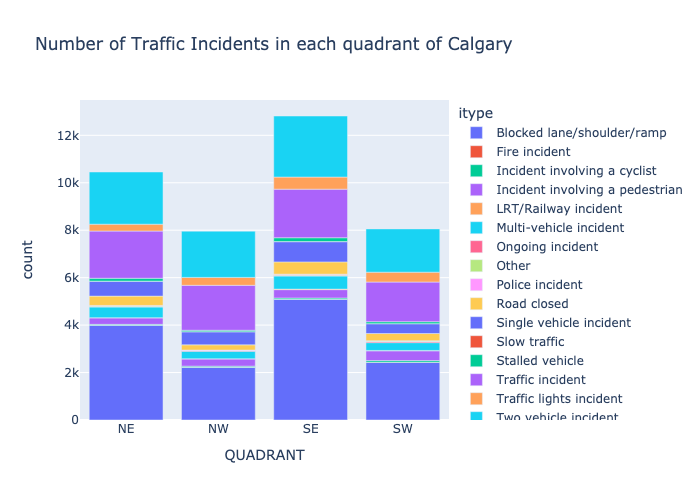

Furthermore, the analysis reveals that several neighborhoods in the central part of Calgary have the highest number of incidents. These neighborhoods include Bridgeland/Riverside, Beltline, Downtown commercial core, Burns industrial, Alberta park/Radisson heights, among others. The concentration of incidents in these central neighborhoods may be attributed to their high population density, commercial activities, or transportation hubs, which can contribute to increased traffic volume and potential incidents.

Understanding the neighborhoods with the highest number of incidents is crucial for traffic management authorities and policymakers to prioritize resources and implement targeted interventions. By focusing on these areas, measures such as improved infrastructure, traffic flow management, and safety campaigns can be implemented to reduce incidents and enhance the overall safety of residents and commuters in Calgary.


```python
#df5 = df[df['itype'] == 'Incident involving a pedestrian'] #Incident involving a cyclist
fig = px.bar(final_df.sort_values(by=['total'], ascending=False).iloc[:20], y='name', x='total', 
             color = 'total',  orientation='h', text = 'total', 
             title = 'Total 20 neighborhoods by number of incidents', width=750, height=550)
fig.update_layout(barmode='stack', yaxis={'categoryorder': 'total ascending'})
fig.update_layout(margin=dict(t=40, b=0, l=0, r=0))
#fig.show()
fig.write_image("fig3.png")

#fig.write_html("top20.html")
```

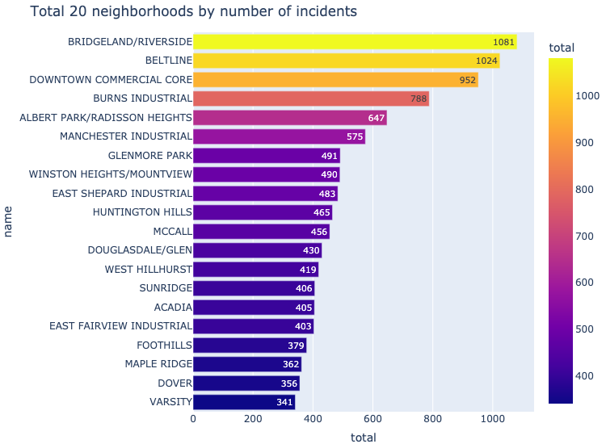

### 2. How does the frequency of traffic incidents in Calgary change based on the time of day?
The question aims to explore how the number of traffic incidents varies throughout different periods of the day. By analyzing the incident data in relation to the time of occurrence, insights can be gained into the temporal patterns and peak hours of incidents in Calgary.

Based on the findings, a timeline analysis reveals two distinct rush hours during which the most traffic incidents occur. The first rush hour happens in the morning at around 8 am, likely corresponding to the peak commuting time when individuals are traveling to work or school. The second rush hour occurs in the evening at around 5 pm, which aligns with the time when people typically finish work and begin their journey home. These periods of increased traffic activity and congestion contribute to a higher frequency of incidents during these specific hours.


```python
df['Datetime'] = pd.to_datetime(df['START_DT'])
df['Datetime'].min().time()
dft = pd.DataFrame(columns = ['Hour', 'itype', 'Count'])
itypes = pd.unique(df['itype'])
for hour in range(24):
    tmin = datetime.time(hour, 0, 0)
    tmax = datetime.time(hour, 59, 59)
    dftemp = df.loc[((df['Datetime'].dt.time >= tmin)&(df['Datetime'].dt.time <= tmax))]
    for itype in itypes:
        count_itype = len(dftemp[dftemp['itype'] == itype])
        #print(tmin, itype, count_itype)
        new_row = pd.DataFrame({'Hour':hour, 'itype': itype, 'Count': count_itype}, index=[0])
        dft = pd.concat([dft.loc[:],new_row]).reset_index(drop=True)

dft.head()
```

    /var/folders/9z/scwdbhm50c1848gsllv1nqk80000gn/T/ipykernel_29114/3376379377.py:1: SettingWithCopyWarning:
    
    
    A value is trying to be set on a copy of a slice from a DataFrame.
    Try using .loc[row_indexer,col_indexer] = value instead
    
    See the caveats in the documentation: https://pandas.pydata.org/pandas-docs/stable/user_guide/indexing.html#returning-a-view-versus-a-copy
    


<div>
<style scoped>
    .dataframe tbody tr th:only-of-type {
        vertical-align: middle;
    }

    .dataframe tbody tr th {
        vertical-align: top;
    }

    .dataframe thead th {
        text-align: right;
    }
</style>
<table border="1" class="dataframe">
  <thead>
    <tr style="text-align: right;">
      <th></th>
      <th>Hour</th>
      <th>itype</th>
      <th>Count</th>
    </tr>
  </thead>
  <tbody>
    <tr>
      <th>0</th>
      <td>0</td>
      <td>Blocked lane/shoulder/ramp</td>
      <td>137</td>
    </tr>
    <tr>
      <th>1</th>
      <td>0</td>
      <td>Traffic incident</td>
      <td>129</td>
    </tr>
    <tr>
      <th>2</th>
      <td>0</td>
      <td>Incident involving a pedestrian</td>
      <td>24</td>
    </tr>
    <tr>
      <th>3</th>
      <td>0</td>
      <td>Single vehicle incident</td>
      <td>87</td>
    </tr>
    <tr>
      <th>4</th>
      <td>0</td>
      <td>Road closed</td>
      <td>32</td>
    </tr>
  </tbody>
</table>
</div>


```python
dft_morning = dft[dft['Hour']<12]
dft_evening = dft[dft['Hour']>=12]
dft_morning['Hour'] = dft_morning['Hour'].astype(str)
dft_evening['Hour'] = dft_evening['Hour'].astype(str)

```

    /var/folders/9z/scwdbhm50c1848gsllv1nqk80000gn/T/ipykernel_29114/2374614761.py:3: SettingWithCopyWarning:
    
    
    A value is trying to be set on a copy of a slice from a DataFrame.
    Try using .loc[row_indexer,col_indexer] = value instead
    
    See the caveats in the documentation: https://pandas.pydata.org/pandas-docs/stable/user_guide/indexing.html#returning-a-view-versus-a-copy
    
    /var/folders/9z/scwdbhm50c1848gsllv1nqk80000gn/T/ipykernel_29114/2374614761.py:4: SettingWithCopyWarning:
    
    
    A value is trying to be set on a copy of a slice from a DataFrame.
    Try using .loc[row_indexer,col_indexer] = value instead
    
    See the caveats in the documentation: https://pandas.pydata.org/pandas-docs/stable/user_guide/indexing.html#returning-a-view-versus-a-copy
    


Morning Rush Hour:


```python
fig = px.bar_polar(dft_morning, r="Count", theta="Hour", color="itype",
                   title="Number of Traffic Incidents by hour",
                   color_discrete_sequence= px.colors.qualitative.Dark24,
                   range_r = [0, 4000],
                   log_r = False
                  )
fig.update_layout(
    font=dict(size=14)
)
#fig.show()
#fig.write_html("morning_total.html")
fig.write_image("fig4.png")

```

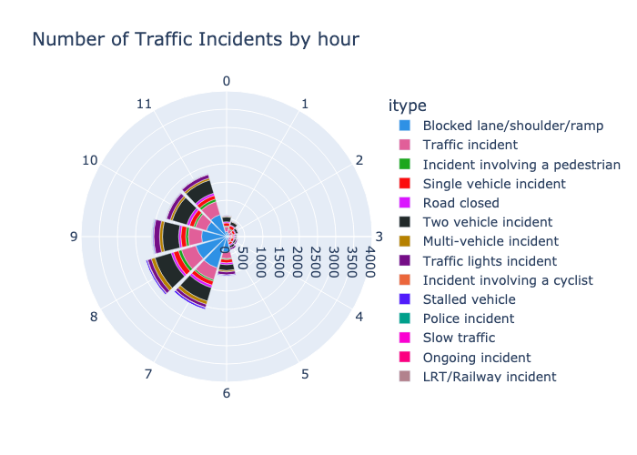

Evening Rush Hour:


```python
fig = px.bar_polar(dft_evening, r="Count", theta="Hour", color="itype",
                   color_discrete_sequence= px.colors.qualitative.Dark24,
                   title="Number of Traffic Incidents by hour",
                   range_r = [0, 4000],
                   log_r = False
                  )
fig.update_layout(
    font=dict(size=14)
)
#fig.show()
#fig.write_html("evening_total.html")
fig.write_image("fig5.png")

```

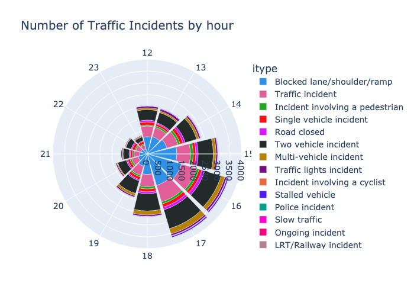

Furthermore, the analysis indicates that incidents connected with blocked lanes or roads contribute significantly to the overall increase in the total number of incidents during rush hours. Blocked lanes or roads can result from accidents, construction work, or other factors that impede the normal flow of traffic. The prevalence of incidents related to blocked lanes or roads during rush hours suggests that traffic congestion and disruptions play a significant role in the occurrence of incidents during peak periods.


```python
fig = px.area(dft, x="Hour", y="Count", color="itype")
fig.update_xaxes(range=[0, 24])
#fig.show()
#fig.write_html("day_total.html")
fig.write_image("fig6.png")

```

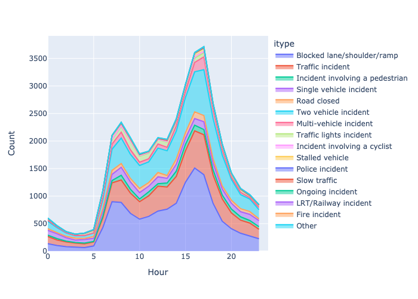

### 3. What are the most dangerous areas for pedestrians and cyclists in Calgary?
The guiding question seeks to identify the locations and time periods where pedestrians and cyclists are most vulnerable to incidents. By filtering the incident data specifically for pedestrian and cyclist-related incidents, it becomes possible to gain insights into the areas and times that pose higher risks for these road users in Calgary.


```python
df5 = df[df['itype'] == 'Incident involving a pedestrian'] #Incident involving a cyclist
fig = px.density_mapbox(df5, lat='Latitude', lon='Longitude', z='Count', radius=5, zoom=10)
fig.update_layout(margin={"r":50,"t":50,"l":50,"b":50}, 
                  autosize=True,
                  height=800, width = 750,
                  mapbox_style="open-street-map")
#fig.show()
#fig.write_html("heatmap_pedestrains.html")
fig.write_image("fig7.png")

```

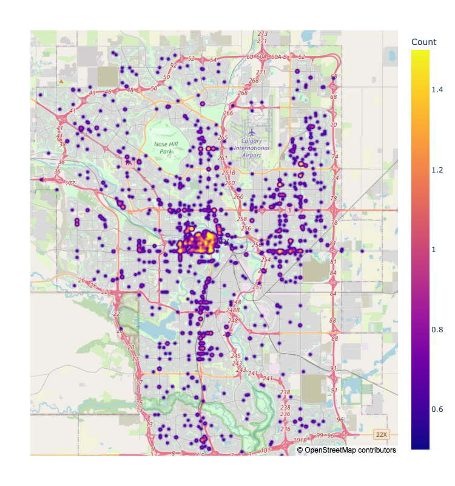

Based on the analysis, the top three worst neighborhoods for pedestrians are identified as Beltline, Downtown commercial core, and Forest Lawn. These neighborhoods have a higher frequency of incidents involving pedestrians, indicating that pedestrians in these areas are at a greater risk of being involved in accidents or facing safety concerns.


```python
fig = px.bar(final_df.sort_values(by=['Incident involving a pedestrian'], ascending=False).iloc[:10], y='name', x='Incident involving a pedestrian', 
             color = 'Incident involving a pedestrian',  orientation='h', text = 'Incident involving a pedestrian', 
             title = 'Top 10 neighborhoods dangerous for pedestrians', width=800, height=400)
fig.update_layout(barmode='stack', yaxis={'categoryorder': 'total ascending'})
fig.update_layout(margin=dict(t=40, b=0, l=0, r=0))
#fig.show()
#fig.write_html("pedestrians.html")
fig.write_image("fig8.png")

```

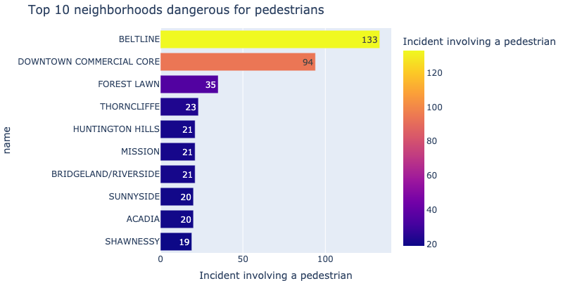

When examining the time periods, it is observed that the morning rush hour at 8 am and the time window from 2 pm to 6 pm are particularly dangerous for pedestrians. The increased incidents during these periods may be attributed to higher pedestrian activity during commute hours and school dismissal times, as well as potential congestion and traffic-related challenges in these neighborhoods.


```python
dft_m2 = dft_morning[dft_morning['itype'] == 'Incident involving a pedestrian']
fig = px.bar_polar(dft_m2, r="Count", theta="Hour", color="itype",
                   color_discrete_sequence= px.colors.qualitative.Dark24,
                   title="Number of incidents with pedestrians by morning hour", 
                   range_r = [0, 125],
                   log_r = False
                  )
fig.update_layout(
    font=dict(size=14)
)
#fig.show()
#fig.write_html("morning_pedestrians.html")
fig.write_image("fig9.png")

```


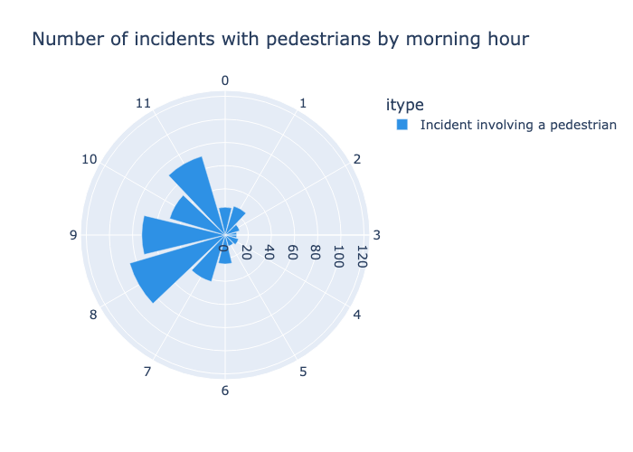


```python
dft_e2 = dft_evening[dft_evening['itype'] == 'Incident involving a pedestrian']
fig = px.bar_polar(dft_e2, r="Count", theta="Hour", color="itype",
                   color_discrete_sequence= px.colors.qualitative.Dark24,
                   title="Number of incidents with pedestrians by evening hour",  
                   range_r = [0, 125],
                   log_r = False
                  )
fig.update_layout(
    font=dict(size=14)
)
#fig.show()
#fig.write_html("evening_pedestrians.html")
fig.write_image("fig10.png")
```


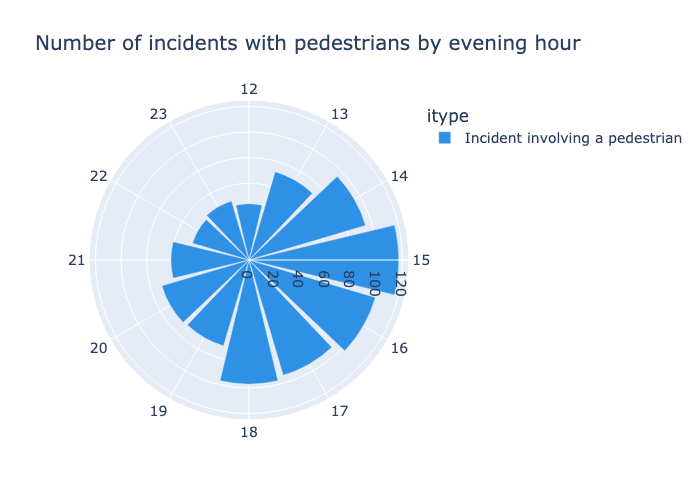

Similarly, the top three worst neighborhoods for cyclists are identified as Beltline, Downtown commercial core, and Sunnyside.


```python
df5 = df[df['itype'] == 'Incident involving a cyclist'] #Incident involving a cyclist
fig = px.density_mapbox(df5, lat='Latitude', lon='Longitude', z='Count', radius=5, zoom=10)
fig.update_layout(margin={"r":50,"t":50,"l":50,"b":50}, 
                  autosize=True,
                  height=800, width = 750,
                  mapbox_style="open-street-map")
#fig.show()
#fig.write_html("heatmap_cyclists.html")
fig.write_image("fig11.png")
```

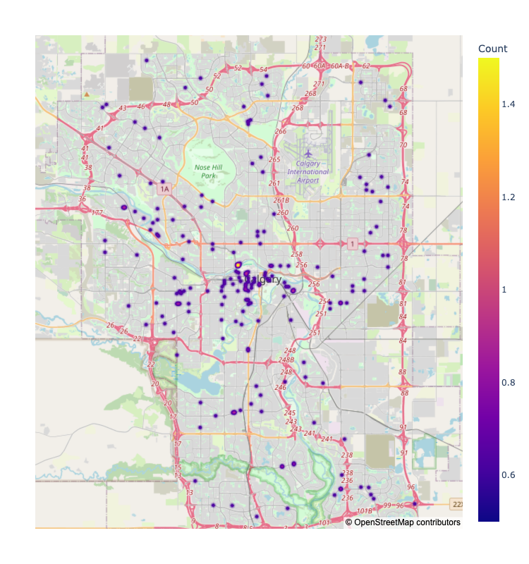

These areas have a higher incidence of cyclist-related incidents, highlighting the risks faced by cyclists in these locations.


```python
#df5 = df[df['itype'] == 'Incident involving a pedestrian'] #Incident involving a cyclist
fig = px.bar(final_df.sort_values(by=['Incident involving a cyclist'], ascending=False).iloc[:10], y='name', x='Incident involving a cyclist', 
             color = 'Incident involving a cyclist',  orientation='h', text = 'Incident involving a cyclist', 
             title = 'Top 10 neighborhoods dangerous for cyclists', width=800, height=400)
fig.update_layout(barmode='stack', yaxis={'categoryorder': 'total ascending'})
fig.update_layout(margin=dict(t=40, b=0, l=0, r=0))
#fig.show()
#fig.write_html("cyclists.html")
fig.write_image("fig12.png")
```


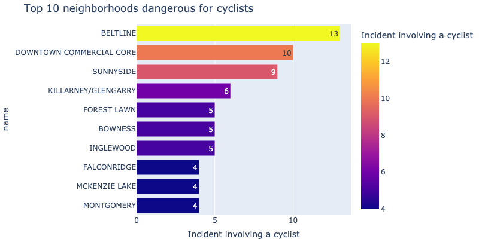

Regarding the time periods for cyclists, the analysis indicates that the time window from 4 pm to 5 pm and around 7 pm is particularly dangerous. These time periods may coincide with peak traffic hours and increased cyclist presence on the road, potentially leading to a higher risk of incidents.


```python
dft_m2 = dft_morning[dft_morning['itype'] == 'Incident involving a cyclist']
fig = px.bar_polar(dft_m2, r="Count", theta="Hour", color="itype",
                   color_discrete_sequence= px.colors.qualitative.Dark24,
                   title="Number of incidents with cyclists by morning hour", 
                   range_r = [0, 25],
                   log_r = False
                  )
fig.update_layout(
    font=dict(size=14)
)
#fig.show()
#fig.write_html("morning_cyclists.html")
fig.write_image("fig13.png")

```


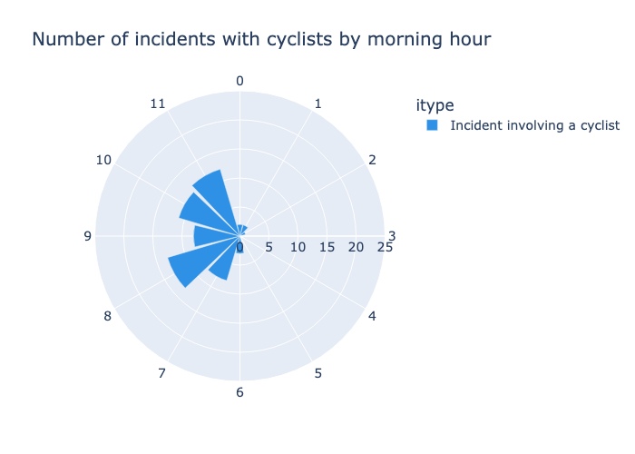


```python
dft_e2 = dft_evening[dft_evening['itype'] == 'Incident involving a cyclist']
fig = px.bar_polar(dft_e2, r="Count", theta="Hour", color="itype",
                   color_discrete_sequence= px.colors.qualitative.Dark24,
                   title="Number of incidents with cyclists by evening hour",  
                   range_r = [0, 25],
                   log_r = False
                  )
fig.update_layout(
    font=dict(size=14)
)
#fig.show()
#fig.write_html("evening_cyclists.html")
fig.write_image("fig14.png")

```


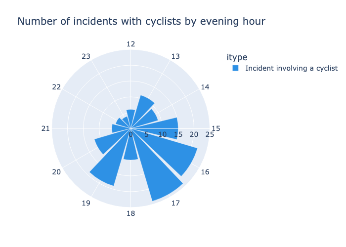

The findings emphasize the importance of focusing on these specific neighborhoods and time periods to implement targeted safety measures and interventions. Enhancements such as improved infrastructure, designated cycling lanes, traffic management strategies, and educational campaigns can help mitigate risks for pedestrians and cyclists in these areas, ultimately promoting safer and more accessible transportation options.


## Conclusion
Overall, the findings highlight the importance of analyzing incident frequency based on neighborhoods, as it allows for a better understanding of localized traffic challenges and helps guide decision-making processes to improve traffic safety and management.

Understanding the temporal patterns of traffic incidents is vital for effective traffic management and the implementation of strategies to reduce incidents during peak hours. By focusing on targeted interventions such as improving traffic flow, managing construction schedules, and enhancing public transportation options, authorities can mitigate congestion and decrease the occurrence of incidents, ultimately improving road safety and minimizing travel disruptions.

The analysis of the frequency of traffic incidents based on the time of day highlights the presence of two rush hours, namely in the morning around 8 am and in the evening around 5 pm, during which the number of incidents is notably higher. Additionally, incidents related to blocked lanes or roads contribute significantly to the overall increase in incidents during these peak periods. These findings emphasize the importance of implementing measures to manage traffic flow and address congestion issues during these specific timeframes to enhance road safety and optimize transportation systems in Calgary.

By understanding the most dangerous areas and times for pedestrians and cyclists in Calgary, authorities and policymakers can prioritize resources, implement proactive safety measures, and raise awareness to ensure the well-being and protection of vulnerable road users.

## References
1. [City of Calgary Open Data portal](https://data.calgary.ca/)
2. [Calgary Traffic Incidents Dataset](https://data.calgary.ca/Transportation-Transit/Traffic-Incidents/35ra-9556)
3. [Calgary Neighborhoods Boundaries Geo-spatial Dataset](https://data.calgary.ca/Base-Maps/Community-Boundaries/ab7m-fwn6)
4. [Plotly Open Source Graphing Library for Python](https://plotly.com/python/)
5. [GeoPandas Library for Python Documentation](https://geopandas.org/en/stable/docs.html)
